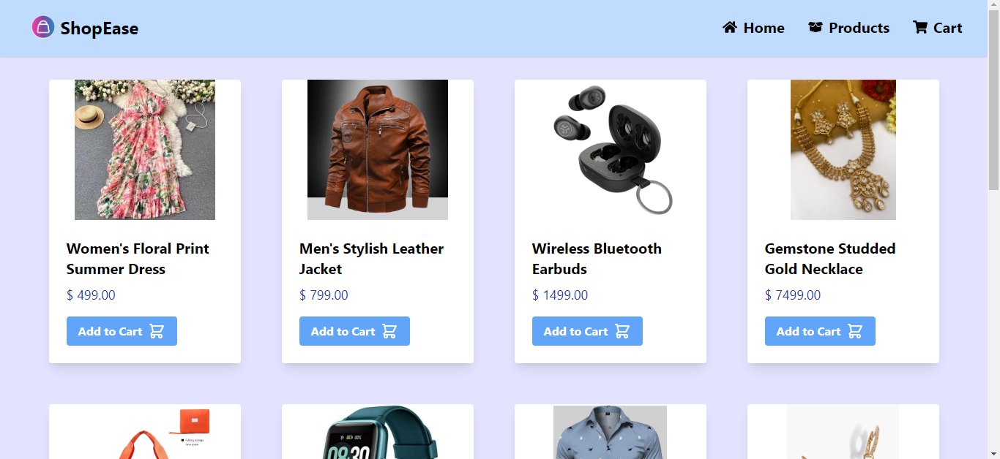
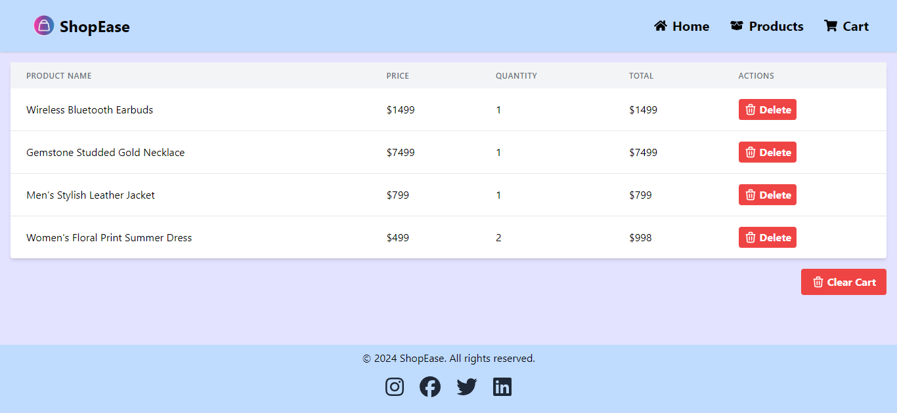
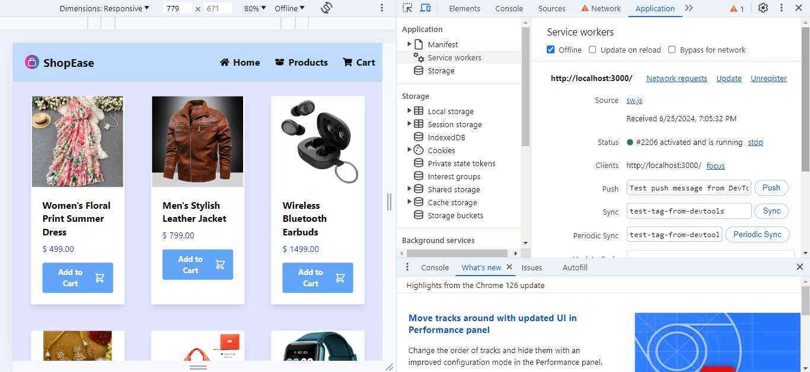

# ShopEase App

This React application displays a list of products fetched from an API. It utilizes Redux for state management and handles offline mode by displaying locally stored products when the user is offline.

## Deployment Link:

[ShopEase App]( )

## Application Demo

## Snapshots

- **Home Page**



- **Cart Page**



- **Offline Mode**



## Features

- Fetches products from a REST API and displays them in layout.
- Handles offline mode by storing products in local storage and displaying them when the user is offline.
- Allows users to add products to a shopping cart.

## Installation

To run this project locally, follow these steps:

1. Clone the repository.
2. Navigate to the project directory:
3. Install the necessary dependencies:

```
npm install
```

4. Run the project.

```
npm start
```

5. The app will start running on http://localhost:3000.

## Components

### Product Component

The `Product` component fetches and displays a list of products from an API using Redux. It handles the following functionalities:

### Cart Component

The `Cart` component displays the current items in the shopping cart using Redux state management. It provides a table layout with columns for product name, price, quantity, total price, and actions (such as removing items from the cart).

### Loader Component

The `Loader` component displays a loading spinner while fetching data from the API or performing other asynchronous tasks. This improves the user experience by indicating that data is being loaded.

## Technologies Used

- React
- Redux Toolkit
- Tailwind CSS
- JavaScript

## Authors

- [@Snehal](https://github.com/Snehal-Salvi)
